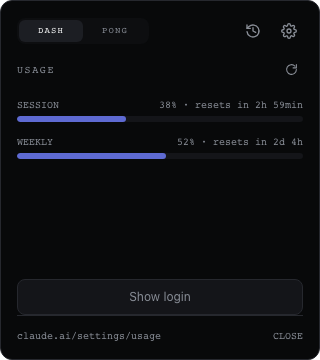
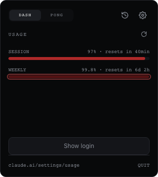
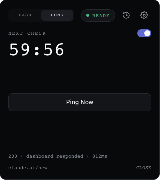

<div align="center">

# 🏓 Pong

**Your Claude session, always warm. Your usage, always in view.**

[](https://github.com/neochaotic/pong/actions/workflows/ci.yml)
[](https://github.com/neochaotic/pong/releases/latest)
[](LICENSE)
[](https://github.com/neochaotic/pong/releases)

[](https://github.com/neochaotic/pong/releases/latest)
[](https://tauri.app)
[](https://www.rust-lang.org)
[](https://svelte.dev)
[](#coverage)

</div>

---

Pong is a menu-bar companion for people who live inside an LLM chat all day. It sits quietly in your
tray and takes care of the three things that otherwise interrupt a session right when you can least
afford it:

- **📊 A live usage dashboard.** Session and weekly consumption, with the reset countdown ticking
  in real time — so "am I about to get throttled?" is a glance, not a tab switch.
- **🔥 Session warm-up.** On a schedule you control, Pong quietly drives the dashboard the way you
  would — so the login screen is never what's waiting for you when you sit down to work. Timed right,
  it also shifts *when* your usage window opens — see [below](#timing-the-warm-up).
- **🩺 A health check that actually checks health.** Not a ping: a synthetic transaction. It types,
  submits, and confirms the app responded, catching a silently broken session before you do.

Under the hood, it drives a hidden webview through a real login session and evaluates injected
JavaScript against the live DOM — the same page, the same cookies, the same path a human takes.
Whatever it finds, it surfaces in one popover: usage, uptime, and a history of both, without ever
leaving your keyboard.

<p align="center">
  
  
  
</p>

### Timing the warm-up

Claude's usage limits run on a rolling session window — five hours is typical — that starts the moment
you send your *first* message, not at a fixed clock time. If you tend to burn through a session fast
(two focused hours, say) and then have to sit out the rest of the window before a new one opens, that
wait tends to land exactly when you'd otherwise keep working.

A scheduled warm-up can turn that into a non-issue, because it's a real message too — it opens a window
just like any other. Schedule one for a time you aren't using Claude anyway, say 5am, and the window
opens then, not when you actually sit down. Start real work at 8am and you're already three hours into
that window: two hours of headroom left before it rolls over at 10am into a *fresh* five-hour window —
one that opens while you're mid-task, not one you have to stop and wait for. The morning reads as one
continuous four-hour stretch (8am–12pm) instead of two hours of work followed by three of watching a
clock: the last two hours of the 5am window, followed straight through by the first two of the next.

This needs `interaction: full` — a warm-up in `probe_only` mode never sends a message, so it never
opens a window. See [Fields](#fields).

## Install

*Full walkthrough with the "damaged" dialog mockup and every fix: [docs/installing.md](docs/installing.md).*

**macOS — Homebrew (recommended):**

```bash
brew install neochaotic/pong/pong
```

This also fixes the Gatekeeper friction described below automatically (see
[neochaotic/homebrew-pong](https://github.com/neochaotic/homebrew-pong) for how), and quits any
running Pong before an upgrade replaces it — see [Updating](#updating-quit-pong-before-you-reinstall).

Otherwise, grab the installer for your platform from the
[latest release](https://github.com/neochaotic/pong/releases/latest):

| Platform | File | Notes |
| --- | --- | --- |
| macOS (Apple Silicon / Intel) | `.dmg` | drag to Applications |
| Windows | `.msi` or `.exe` | `.msi` for managed installs |
| **Linux — any distro** | `.AppImage` | portable; `chmod +x` and run, no install |
| Debian / Ubuntu | `.deb` | `sudo apt install ./Pong_*.deb` |
| Fedora / RHEL / openSUSE | `.rpm` | `sudo dnf install ./Pong-*.rpm` |

### First launch: the builds are not code-signed

Signing needs a paid Apple Developer account and a Windows code-signing certificate — neither is
set up yet, so every install hits an OS warning on the very first launch. Read this before you
open the app for the first time, not after:

- **macOS**: a plain double-click will silently fail — Gatekeeper blocks the launch *before the
  process starts*, and because Pong is a menu-bar-only app (no Dock icon, no window), nothing
  visibly happens. No crash dialog, no bounce, nothing. It looks exactly like the install did
  nothing, even though it worked. Sometimes, instead of that silent failure, you get an explicit
  **"Pong.app is damaged and can't be opened"** dialog telling you to move it to the Trash — same
  root cause (unsigned + quarantined), just a scarier, more misleading message. **The app is not
  actually damaged; do not trash it.** Fix either case with one of:
  - Right-click the app → *Open* → *Open* (do this once; normal double-clicks work afterward), or
  - Terminal: `xattr -cr /Applications/Pong.app && open /Applications/Pong.app`
- **Windows**: SmartScreen shows a warning — *More info* → *Run anyway*.

If you've done this and still don't see the tray icon, that's a real bug — please
[open an issue](https://github.com/neochaotic/pong/issues/new).

### Updating: quit Pong before you reinstall

Dragging a new `.dmg` over an existing install just replaces files on disk — Finder's "replace?"
prompt has no way to signal a process that's already running, and Pong being tray-only (no Dock
icon) means there's nothing to bounce or close for you. The **old process keeps running**,
completely unaffected, and the version string in Settings (baked in at build time) keeps showing
the version it was launched with. It looks like the update silently did nothing; it actually
installed fine, you're just still looking at the old process.

Quit Pong first — tray icon → *Quit* (or `killall pongllm`) — *then* replace and reopen. Verified
on macOS; the same applies in principle on Windows/Linux, since none of the three installers
coordinate with a running instance either.

### Uninstalling

Pong launches at login by default (Settings → *Launch at login*, on by default — a tray monitor
that doesn't come back after a reboot isn't much of a monitor). None of the three installers know
to remove that login-item registration, because Pong creates it itself at runtime, after install —
**turn the toggle off before you uninstall**, or the OS will keep a harmless but orphaned entry
pointing at a binary that no longer exists (it just silently fails to launch; it won't error or
affect anything else).

If you already uninstalled without turning it off first, or want to clean up by hand:

| Platform | Login item | Also removes |
| --- | --- | --- |
| macOS | Delete `~/Library/LaunchAgents/Pong.plist` | `~/Library/Application Support/com.pongllm.monitor/`, `~/Library/Logs/com.pongllm.monitor/` |
| Windows | Delete the `Pong` value under `HKEY_CURRENT_USER\SOFTWARE\Microsoft\Windows\CurrentVersion\Run` (`regedit`, or `reg delete "HKCU\SOFTWARE\Microsoft\Windows\CurrentVersion\Run" /v Pong`) | `%APPDATA%\com.pongllm.monitor\` |
| Linux | Delete `~/.config/autostart/Pong.desktop` | `~/.config/com.pongllm.monitor/` |

The "also removes" column is Pong's config, logs and the hidden webview's session data (cookies,
local storage — this is what keeps you signed in) — none of it is touched by the OS installers'
own uninstall/remove step either, so it's worth clearing at the same time if you want a truly clean
removal rather than a reinstall-friendly one.

---

## Why a hidden webview instead of an HTTP request?

An HTTP `GET` tells you the server is up. It cannot tell you that the dashboard renders, that your
session is still valid, or that submitting a form still produces a response. Pong drives a real
browser engine with real cookies, so a check exercises the same path a human would.

---

## Architecture

```
┌──────────────────────────────────────────────────────────────┐
│ Rust (Tauri v2)                                              │
│                                                              │
│  tokio-cron-scheduler ──tick──►  monitor::run_health_check   │
│                                        │                     │
│                    1. heartbeat        │  2. full check      │
│                          ▼             ▼                     │
│                    webview.eval(<injected JS>)               │
│                          │                                   │
│  AppState  ◄──IPC report_health──┐                           │
│    │                             │                           │
│    └──emit("monitor://update")──►│                           │
└──────────┬───────────────────────┼───────────────────────────┘
           │                       │
   ┌───────▼────────┐     ┌────────┴──────────────────────────┐
   │ Popover        │     │ Hidden webview  (label: "monitor")│
   │ Svelte 5 + TW  │     │ target dashboard + probe agent    │
   │ (label:popover)│     │ persistent cookies on disk        │
   └────────────────┘     └───────────────────────────────────┘
```

### Waiting, not guessing

A single-page app mounts asynchronously, so querying the DOM once and giving up
reports a healthy dashboard as broken — a false negative, the worst failure mode
for a monitor.

Every lookup during a check goes through `waitForElement`, which polls every
100ms up to `element_timeout_ms` and requires the element to be *interactive*,
not merely present: not `disabled`, not `aria-disabled`, and not zero-sized.

That distinction carries real signal. A React form typically keeps its submit
button disabled until the editor reports content, so **waiting for the button to
enable is itself a check that the synthetic typing reached the app's state** — not
just the DOM. If it never enables, the report says so explicitly rather than
blaming the dashboard.

### Typing into rich editors

`full` interaction handles two very different targets:

- **Plain fields** (`<input>`, `<textarea>`) — React and Vue cache the value in their
  own state, so the agent writes through the prototype's native setter and fires
  `input`.
- **Rich editors** (ProseMirror, Slate, Lexical, TipTap) — these keep a private
  document model and treat the DOM as a render target; assigning `textContent` is
  ignored or reverted, and the editor's state never sees the text. The agent instead
  drives the input pipeline: a cancellable `beforeinput` carrying
  `inputType: "insertText"`, then `document.execCommand("insertText")`, which makes
  the browser mutate the selection and fire the events natively. A manual
  `beforeinput` + range insertion is the fallback when an editor cancels the command.

Enter is handled the same way: rich editors bind it in `keydown` and call
`preventDefault`. If the editor claims the key, the agent does not also call
`form.requestSubmit()`, which would submit twice.

Point `selectors.text_input` at the editable node — the default
`textarea, div[contenteditable="true"]` matches both kinds.

### The check pipeline

Every run is two phases, so a dead session is detected before anything is typed into it:

1. **Heartbeat** (read-only). Rust evals `__PONG__.heartbeat()`. The agent inspects the DOM:
   - `selectors.login_indicator` present → **401**, stop here and notify.
   - `selectors.authenticated` present → **200**, proceed.
   - neither → **503**.
2. **Synthetic interaction**. Rust evals `__PONG__.runCheck()`, which:
   - clicks `selectors.action_button` (if configured),
   - types `payload` into `selectors.text_input` **one character at a time**, firing real
     `keydown` / `input` / `keyup` events,
   - presses **Enter** (and calls `form.requestSubmit()` when inside a form),
   - waits `settle_ms` for the DOM to react,
   - re-probes and reports `200`, `401` or `503`.

Every eval carries a **nonce**. Reports whose nonce no longer matches an in-flight probe are
discarded, so a late reply from a previous run can never be mistaken for the current one.

**Capturing the reply.** When `selectors.response` is set, a successful check does not stop at
`settle_ms`. It polls the *last* element matching that selector and waits for its text to stop
changing for 800ms (bounded by `element_timeout_ms`) before reporting it as the check's `detail`.
A fixed wait risks grabbing a reply mid-stream; polling for stability adapts to however long the
dashboard actually takes to finish responding.

### Status codes

| Code    | Verdict        | Meaning                                        |
| ------- | -------------- | ---------------------------------------------- |
| 200–299 | `healthy`      | Authenticated and the dashboard responded      |
| 401/403 | `unauthorized` | Login screen detected — session expired        |
| 408     | `degraded`     | The probe never reported back in time          |
| 500–599 | `degraded`     | Reached the page, but markers/DOM were wrong   |
| other   | `unreachable`  | Navigation or injection failed outright        |

---

## Signing in

The default target is `https://claude.ai/new`, so a fresh install has something real to
authenticate against out of the box.

1. Click the tray icon → **Show login** (or the tray menu → *Show/Hide Login Window*).
2. The dashboard window appears. Sign in by hand — Pong never handles credentials.
3. Click **Hide login**. Monitoring continues against the now-authenticated session.
4. Quit and relaunch: the session should still be valid, because the webview's
   cookie jar lives on disk (see below).

### Clearing the session

**Settings → Clear session data** erases cookies, local storage and caches via
`clear_all_browsing_data()`, then reloads the login page. It takes two clicks —
there is no undo, and it signs you out of the dashboard.

Use it to switch accounts, or when a half-expired session leaves the page in a
state that matches neither marker and every check reports `503`.

To sign back in afterwards — as the same account or a different one — it's the
same three steps as [Signing in](#signing-in) above: **Show login**, sign in by
hand, **Hide login**. Log out and log back in is that flow twice in a row, not
a separate feature.

## Session persistence

The hidden webview is built with `.data_directory(app_data_dir/webview-session)`, so cookies and
local storage survive restarts and you stay logged in.

**Platform caveat, verified rather than assumed:** `data_directory` is honoured by WebView2
(Windows) and WebKitGTK (Linux). On **macOS** `WKWebView` ignores it — the directory is created
and stays empty. Cookies land in `~/Library/HTTPStorages/pongllm.binarycookies` instead, keyed by
the *executable* name. Persistence works on all three platforms; only the location differs.

### Permissions

Pong declares no macOS usage descriptions and requests nothing beyond notifications. It needs no
accessibility, screen-recording or automation access: the synthetic interaction happens inside its
own webview via injected JavaScript, not by driving the OS. If macOS prompts for anything else
while you are developing, it is coming from your terminal or editor, not from this app.

When a check comes back `401`, Pong:

1. fires a native notification — *"Dashboard session expired — reconnect from the menu bar."*
2. opens the popover in recovery mode with a **Reconnect dashboard** button, which un-hides the
   webview so you can log in by hand;
3. once you confirm, hides it again and resumes monitoring.

> **Why the notification is not clickable.** The official `tauri-plugin-notification` exposes no
> click/action handler on desktop ([plugins-workspace#2150](https://github.com/tauri-apps/plugins-workspace/issues/2150)
> is still open). Rather than promise a click that does nothing, Pong opens the popover itself so
> the Reconnect button is already in front of you.

The notification fires only on the *transition* into the unauthorized state, so a dashboard left
logged out does not nag you every cron tick.

---

## History

The popover keeps the last 50 checks — click the clock icon. Each row shows the
time, status code, detail and latency, with a healthy/total summary at the top.

The buffer is bounded on purpose: this process is expected to run for weeks.

## Configuration

`config.json` is created on first launch, in the OS config directory:

| Platform | Path                                                            |
| -------- | --------------------------------------------------------------- |
| macOS    | `~/Library/Application Support/com.pongllm.monitor/config.json` |
| Linux    | `~/.config/com.pongllm.monitor/config.json`                     |
| Windows  | `%APPDATA%\com.pongllm.monitor\config.json`                     |

```json
{
  "target_url": "https://example.com/login",
  "cron": "0 0 5 * * Mon-Fri",
  "cron_enabled": false,
  "selectors": {
    "authenticated": "#dashboard-main",
    "login_indicator": "input[type=password]",
    "action_button": "#new-chat",
    "text_input": "textarea"
  },
  "usage_url": null,
  "payload": "ping",
  "settle_ms": 3000,
  "typing_delay_ms": 60,
  "notifications_enabled": true,
  "autostart_enabled": true,
  "interaction": "probe_only"
}
```

> **`cron_enabled` defaults to `false`, on purpose.** A fresh install (or a hand-edited
> config with a typo'd cron) should not start driving your dashboard on a schedule until
> you deliberately turn it on — from the popover's quick toggle or the Settings panel.
> The default cadence, once enabled, is 5am on weekdays.

> **`interaction` defaults to `probe_only`, on purpose.** A full check types into
> whatever `text_input` matches and presses Enter — on a real dashboard that can post
> a comment or submit a form, once per cron tick, forever. Start in `probe_only`,
> confirm your selectors are pointing at a scratch surface, then switch to `full`.

### Fields

| Field                     | Meaning                                                                     |
| ------------------------- | --------------------------------------------------------------------------- |
| `target_url`              | Dashboard entry point. Must be `http`/`https`.                              |
| `cron`                    | **Six fields, including seconds**: `sec min hour day-of-month month day-of-week`. |
| `cron_enabled`            | Whether the schedule actually runs. Defaults to `false`.                    |
| `selectors.authenticated` | Present **only** when logged in. This is the health signal.                  |
| `selectors.login_indicator` | Present **only** when logged out. Drives the 401 path.                    |
| `selectors.action_button` | Optional. Clicked before typing. Use `null` to skip.                        |
| `selectors.submit_button` | Optional. Waited on until enabled, then clicked. Falls back to Enter if unset. |
| `selectors.text_input`    | `<input>`, `<textarea>` or a `contenteditable` element.                     |
| `selectors.response`      | Optional. Matches each reply bubble; the last match's text (once it stops changing) becomes the check's `detail` instead of a generic "dashboard responded". |
| `cleanup.menu_button`, `cleanup.delete_option`, `cleanup.confirm_button` | Optional. Deletes what a successful check just created (e.g. a chat), scoped to the page currently open so it can never touch anything else. Each step runs only if set. |
| `usage_url`               | Optional. A usage/consumption page (currently tuned for claude.ai's) to power the popover's live usage dashboard. `null` hides it. |
| `payload`                 | The string typed during a check.                                            |
| `settle_ms`               | How long to wait for the DOM after Enter. Max `60000`.                      |
| `typing_delay_ms`         | Per-keystroke delay. Max `2000`.                                            |
| `element_timeout_ms`      | How long to wait for an element to mount and become usable. Max `120000`.   |
| `notifications_enabled`   | Native OS notification on session expiry.                                   |
| `autostart_enabled`       | Launch at login. Defaults to `true`; kept in sync with the OS's actual registration on every launch and every save. See [Uninstalling](#uninstalling). |
| `interaction`             | `probe_only` (default) inspects the DOM only. `full` clicks, types and submits. |

Invalid values are rejected with a specific error rather than silently defaulted — a bad cron
string or a `file://` URL will refuse to load.

You can edit these fields either by hand or through the **⚙ settings panel** in the popover, which
validates locally before saving and surfaces the backend's error verbatim if it still refuses.

### Cron examples

| Expression      | Meaning              |
| --------------- | -------------------- |
| `0 */5 * * * *` | every 5 minutes      |
| `0 0 * * * *`   | hourly, on the hour  |
| `30 0 9 * * *`  | daily at 09:00:30    |
| `0 0 9 * * Mon` | Mondays at 09:00     |

### Picking selectors for your dashboard

1. Open your dashboard in a browser and log in.
2. DevTools → inspect an element that exists **only when logged in** (a sidebar, a main container).
   That is `authenticated`.
3. Log out, and find an element that exists **only on the login screen** (a password field is the
   most reliable). That is `login_indicator`.
4. Find the input you want to exercise → `text_input`; and the button that reveals it, if any →
   `action_button`.
5. Prefer stable hooks (`#id`, `[data-testid]`) over generated class names, which change on deploy.

Changes to `target_url` and `cron` are applied live — the webview re-navigates and the cron job is
reinstalled without a restart.

---

## How the webview talks back to Rust (and why it needs two files)

This is the least obvious part of the app. The hidden webview loads a **remote origin**, and in
Tauri v2 a remote origin reaches *no* IPC command by default — not even commands the app defines
itself. Getting a report back to Rust requires two pieces working together:

**1. `src-tauri/permissions/report-health.toml`** — an application permission that allows the
command. Without it the invoke is rejected at runtime with:

```
report_health not allowed. Plugin not found
```

(That message is misleading: nothing is wrong with plugins. It means the ACL found no permission
granting the command.)

```toml
[[permission]]
identifier = "allow-report-health"
commands.allow = ["report_health"]
```

**2. `src-tauri/capabilities/monitor.json`** — binds that permission to the `monitor` window and
lists the origins allowed to use it.

```json
{
  "windows": ["monitor"],
  "remote": { "urls": ["http://*:*/*", "https://*:*/*"] },
  "permissions": ["allow-report-health"]
}
```

> **Ports are a separate URLPattern component.** `https://*/*` does **not** match
> `http://localhost:8899`. Include `*:*` patterns if you monitor a non-standard port.

### Passkeys are not supported in the sign-in window

Embedded webviews implement WebAuthn only partially. GitHub says so outright —
*"This browser or device is reporting partial passkey support"* — and a Google
account whose second factor is a passkey falls into the cross-device Bluetooth
flow and fails there.

The warning appears, but sign-in still completes through another factor. Verified
on GitHub: approving from the **GitHub Mobile app** works, as do *More options* →
TOTP from an authenticator app, SMS, or a recovery code.

This affects only the moment of authentication — once signed in, the session
persists normally across restarts.

This is a limitation of the platform's webview, not something Pong can work
around.

### "Continue with Google" may fail in the sign-in window

Verified on claude.ai: if the Google account signing in uses a passkey, it hits the
same cross-device Bluetooth flow as above and fails the same way — claude.ai then
shows a generic *"There was an error logging you in"*. This isn't claude.ai or
Google specifically blocking embedded webviews; it's the same partial WebAuthn
support, reached through a different door.

The professional fix for OAuth-in-a-webview is well established — Google's own
guidance (RFC 8252) is to run the flow in the system's real browser and capture the
redirect via a custom URL scheme or a local loopback server, which is why apps like
Slack or Docker Desktop show "Continue in browser." That doesn't carry over cleanly
here: it solves the OAuth handshake, but Pong doesn't just need a token — it needs
the resulting session *cookies* live inside its own hidden webview, so the scheduled
checks can use them unattended. A system-browser handoff leaves those cookies in the
system browser's jar instead, with no clean, non-hacky way to move them into the
webview's own cookie store afterward.

**Workaround:** sign in with email/password (or a non-WebAuthn second factor —
TOTP or SMS) for the account Pong monitors. Once signed in, the session persists
normally regardless of how you got there.

### SSO redirects

Signing in through an identity provider (Google, Okta, Azure AD) navigates the webview to
*their* domain — a page holding the user's real password field, where the probe selectors mean
nothing.

The injected agent therefore compares `location.hostname` against the host of `target_url` before
doing anything, at both entry points. Off-host it reports `401 — redirected to <host>
(sign-in required)` and touches nothing. Without that guard, a `full` check could type the payload
into a credential form.

This is also why `interaction` defaults to `probe_only`.

### Security note

`report_health` is deliberately the *only* command exposed to the dashboard. It accepts a status
code and a detail string and can neither read nor mutate anything else. The `remote.urls` list ships
permissive so any configured dashboard works out of the box — **narrow it to your own domain before
deploying:**

```json
"remote": { "urls": ["https://dashboard.your-company.com/*"] }
```

## Logs

Every verdict is logged, to stdout in dev and to the OS log directory in release
(`~/Library/Logs/com.pongllm.monitor/pongllm.log` on macOS):

```
[INFO] check finished: 200 Healthy (2165ms) — dashboard responded
[INFO] check finished: 401 Unauthorized (3ms) — login screen detected
[WARN] probe 7 timed out after 8s (page title: "…")
```

Navigation events are logged too, which is the quickest way to spot a dashboard silently redirecting
to an SSO provider.

---

## Known issues (this RC)

Development and day-to-day testing so far has been on macOS. CI compiles, tests and bundles Pong
on all three platforms on every push (see `ci.yml`'s `test-matrix` and `bundle` jobs) — but that
proves the *build* works, not that the UI *looks* right on a real Windows or Linux desktop, which
no one has checked yet. Flagging the specific risk areas rather than a vague "may vary by platform":

- **The popover window** (`transparent(true)` + `decorations(false)` + `always_on_top(true)`) is the
  entire UI. This exact combination has historically been the least portable part of Tauri across
  Windows (pre-Windows 11 or without Mica) and Linux (WebKitGTK + compositor) — the known failure
  mode is a solid black background instead of a transparent one, rather than a crash. If you hit
  this, it's a real bug worth reporting, not a "works as intended" platform quirk.
- **The tray icon** is a template image (`icon_as_template(true)`), which macOS recolors
  automatically to match the menu bar. That setting does nothing on Windows/Linux — the icon
  renders in its literal colors there, which may not read well against every taskbar.
- **Linux tray icons need `libappindicator3`** (bundled as a dependency of the `.deb`/`.rpm`) and,
  on GNOME specifically, a shell extension (e.g. AppIndicator/KStatusNotifierItem) — without one,
  the tray icon will not appear at all. This is a GNOME limitation, not something Pong's installer
  can fix.
- **Builds are not code-signed** (see [Install](#install)) — expected friction on first launch on
  both macOS and Windows, not a bug.

If you're testing on Windows or Linux, a report of "the popover looks/behaves like X" — good or
bad — is exactly the signal this RC is for.

---

## Development

```bash
pnpm install
pnpm tauri dev      # run the app
pnpm tauri build    # produce a bundle
```

> **Tip — keep the build cache out of the repo folder.** A Tauri `target/` directory grows to
> several GB. Exporting a shared cache keeps project folders small and lets Rust projects reuse
> each other's compiled dependencies:
>
> ```bash
> export CARGO_TARGET_DIR="$HOME/.cargo-target"   # in ~/.zshrc or ~/.bashrc
> ```
>
> Use the environment variable rather than `.cargo/config.toml`: the latter needs an absolute path,
> which would not resolve on a teammate's machine.

### Tests

```bash
pnpm verify              # versions + types + both suites + both coverage gates
```

Or individually:

```bash
pnpm test                # 133 Vitest tests
pnpm test:coverage       # frontend coverage, fails under 70%
pnpm test:rust           # 138 Rust tests
pnpm test:rust:coverage  # Rust coverage, fails under 70%
pnpm check               # svelte-check
cd src-tauri && cargo clippy --all-targets && cargo fmt --check
```

### Releasing

Versions live in three manifests (`package.json`, `src-tauri/tauri.conf.json`,
`src-tauri/Cargo.toml`) and `pnpm check:version` asserts they agree.

Tag to publish. The tag carries the pre-release identifier; the manifests stay numeric:

```bash
git tag v0.0.1-rc.1 && git push origin v0.0.1-rc.1   # flagged pre-release
git tag v0.0.1     && git push origin v0.0.1       # flagged stable
```

> **Why the manifest cannot say `0.0.1-rc1`.** Tauri's Windows bundlers reject
> pre-release identifiers ([#5286](https://github.com/tauri-apps/tauri/issues/5286),
> [#12470](https://github.com/tauri-apps/tauri/issues/12470)). Such a version builds
> fine on macOS and Linux, then fails only in the Windows release job.
> `pnpm check:version` blocks it locally so you find out in seconds, not after a
> 15-minute matrix build.

Any tag with a `-suffix` is marked as a pre-release on GitHub, so it never
becomes "Latest release". Releases are created as drafts — review the installers
before publishing.

### Coverage

Both suites enforce a **70% floor** and currently sit well above it:

| | Statements / Regions | Lines |
| --- | --- | --- |
| Frontend | 93.5% | 95.7% |
| Rust (logic) | 82.4% | 84.2% |

**What the Rust number excludes, and why.** `lib.rs`, `tray.rs` and `main.rs` are wiring:
window construction, IPC registration, tray callbacks. None of it exists until a real app,
tray and webview are running, so unit tests cannot reach it — the same reason `main.ts` is
excluded on the frontend. The gate measures the logic; the wiring is verified by running
the app.

**Read the number with that caveat in mind.** Every bug found in this project so far lived
in the wiring band: the missing ACL permission that silently blocked *every* IPC command,
a Promise rejection swallowed by a synchronous `try/catch`, and macOS suspending occluded
webviews. A perfectly green logic suite would have caught none of them. High coverage here
means the rules are right — not that the app runs.

The pipeline has also been exercised end to end against a local fake dashboard, covering the healthy
path (click → type → Enter → 200), the session-expiry path (DOM swapped for a login form → 401) and
the in-between state where neither marker is present (503).

The Rust suite covers config parsing/validation, cron arithmetic, verdict mapping, JS-injection
escaping, and the nonce-correlated probe state machine. Logic is deliberately kept in pure modules
(`config`, `scheduler`, `health`, `injection`, `state`) so it is testable without a display server;
`lib.rs`, `tray.rs` and the eval calls are the only parts that need a running app.

### Layout

```
src/                    Svelte 5 popover UI
  App.svelte            tab switcher (dash/monitor), view routing, IPC wiring
  lib/UsageView.svelte   the usage dashboard tab
  lib/Toggle.svelte      shared switch control
  lib/SettingsView.svelte
  lib/HistoryView.svelte
  lib/StatusBadge.svelte
  lib/format.ts         pure display helpers (unit tested)
  lib/configForm.ts     Config <-> form-state mapping + client-side validation
  lib/api.ts            typed IPC wrapper
src-tauri/src/
  config.rs             config.json parsing + validation
  scheduler.rs          cron arithmetic (pure)
  health.rs             verdicts, phases, reports
  usage.rs              usage-panel parsing (locale-tolerant, pure)
  injection.rs          builds the evaluated JS (escaping via serde_json)
  agent.js              the injected probe agent + usage scraper
  state.rs              AppState + nonce correlation (health and usage)
  monitor.rs            the check pipeline (health checks and usage checks)
  tray.rs               tray icon, menu, popover toggle
  lib.rs                wiring: windows, IPC commands, scheduler
src-tauri/tests/acl_test.rs   catches a command missing from the popover's ACL
src-tauri/permissions/  ACL permissions for report_health / report_usage
src-tauri/capabilities/ binds permissions to windows and remote origins
scripts/                Playwright helpers used to discover claude.ai selectors
```

---

## Implementation notes

**Framework-aware typing.** React and Vue keep their own copy of an input's value and revert a plain
`el.value = x`. The agent writes through the prototype's native setter
(`Object.getOwnPropertyDescriptor(proto, "value").set`), which is what makes the framework observe
the change. `contenteditable` elements are handled separately.

**Injection safety.** Selectors and payload never reach JS via string concatenation. They cross as a
single `serde_json`-encoded object literal, so escaping is the serializer's job. Tests assert that
quotes, backslashes and newlines cannot break out.

**Tray-only.** No window is declared in `tauri.conf.json`; both webviews are created programmatically.
On macOS the activation policy is set to `Accessory`, so there is no dock icon and no app-switcher
entry. `ExitRequested` is intercepted so closing the popover does not quit the app.
