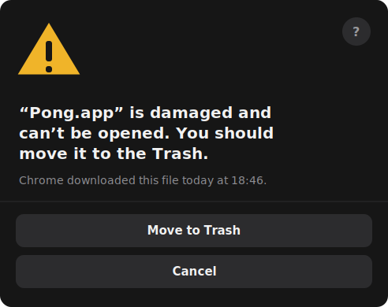

# Installing Pong

## Recommended: Homebrew (macOS)

```bash
brew install neochaotic/pong/pong
```

This is the easiest path on macOS, and it's not just convenience — the
[Cask](https://github.com/neochaotic/homebrew-pong) actively works around the two rough edges
described below:

- It strips the quarantine flag automatically after install, so you never see a Gatekeeper
  warning at all.
- Its `uninstall quit:` stanza terminates any running Pong *before* `install`/`upgrade`/`uninstall`
  replaces the app — so an update can never silently leave an old process running underneath a
  new binary (see [Updating](#updating-quit-pong-before-you-reinstall) below for what that bug
  looks like if you hit it manually).

If you don't use Homebrew, or you're on Windows/Linux, the manual steps below cover you.

## Manual install

Grab the installer for your platform from the
[latest release](https://github.com/neochaotic/pong/releases/latest):

| Platform | File | Notes |
| --- | --- | --- |
| macOS (Apple Silicon / Intel) | `.dmg` | drag to Applications |
| Windows | `.msi` or `.exe` | `.msi` for managed installs |
| **Linux — any distro** | `.AppImage` | portable; `chmod +x` and run, no install |
| Debian / Ubuntu | `.deb` | `sudo apt install ./Pong_*.deb` |
| Fedora / RHEL / openSUSE | `.rpm` | `sudo dnf install ./Pong-*.rpm` |

## First launch: the builds are not code-signed

Signing needs a paid Apple Developer account and a Windows code-signing certificate — neither is
set up yet, so a manually-installed build hits an OS warning on the very first launch. Read this
*before* you open the app for the first time, not after.

### macOS: the silent failure

A plain double-click will just... fail, with nothing to show for it. Gatekeeper blocks the launch
*before the process starts*, and because Pong is a menu-bar-only app (no Dock icon, no window),
there's nothing to bounce or flash. No crash dialog, no error, no sound. It looks exactly like the
install did nothing — but it actually worked fine, you're just being blocked from opening it.

### macOS: the "damaged" dialog

Sometimes, instead of that silent failure, macOS shows something much more alarming — a dialog
that looks roughly like this (recreated for documentation purposes, not an actual screen capture):

<p align="center">
  
</p>

This is the same root cause as the silent failure above (unsigned + quarantined) — it is **not**
a corrupted download and the app is **not** actually damaged. macOS just phrases Gatekeeper's
rejection more dramatically in this variant, and puts the destructive action as the default-looking
button. **Do not click "Move to Trash."** Click Cancel and use one of the fixes below.

### The fix (covers both cases)

- Right-click the app → *Open* → *Open* (do this once; normal double-clicks work afterward), or
- Terminal:
  ```bash
  xattr -cr /Applications/Pong.app
  open /Applications/Pong.app
  ```

If you've done this and still don't see the tray icon, that's a real bug — please
[open an issue](https://github.com/neochaotic/pong/issues/new).

### Windows

SmartScreen shows a warning — *More info* → *Run anyway*.

## Updating: quit Pong before you reinstall

Dragging a new `.dmg` over an existing install just replaces files on disk — Finder's "replace?"
prompt has no way to signal a process that's already running, and Pong being tray-only (no Dock
icon) means there's nothing to bounce or close for you either way. The **old process keeps
running**, completely unaffected by the files underneath it changing, and the version string shown
in Settings (baked in at build time) keeps displaying whatever version it was launched with. It
looks like the update silently did nothing; it actually installed fine — you're just still looking
at the old process.

Quit Pong first — tray icon → *Quit* (or `killall pongllm`) — *then* replace and reopen. Verified
on macOS; the same applies in principle on Windows/Linux, since none of the three manual installers
coordinate with a running instance either. (Homebrew's Cask handles this step for you
automatically — see above.)

## Uninstalling

See the [README's Uninstalling section](../README.md#uninstalling) for the full per-platform
cleanup steps (login item, config, logs, session cookies).
